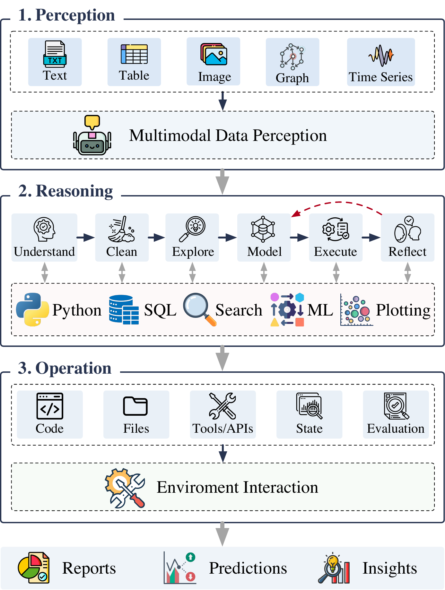

<h1 align="center"> DataNova </h1>

<p align="center">
  <b>A family of autonomous and self-evolving data-science agents for real-world mathematical modeling, multimodal scientific discovery, and end-to-end data analysis.</b>
</p>

<div align="center">

[](https://github.com/luckyfan-cs/DataNova)
[](#license)


</div>

<div align="center">
  
</div>

---

## Overview

**DataNova** is a research project family for building and understanding autonomous data-science agents. The project explores how LLM agents perceive multimodal data, reason with scientific and mathematical modeling workflows, operate tools and environments, and evolve their capabilities through experience.

DataNova currently covers five connected directions:

- **Real-world mathematical modeling** with LLM-based agents.
- **Multimodal scientific discovery** powered by data-driven agent systems.
- **Self-evolving autonomous data science** through capability learning and context management.
- **Foundation models for scientific discovery** from paradigm enhancement to paradigm transition.
- **Explicit agent harnesses** for reliable data-science automation.

## News

- **[2026]** DataNova expands toward self-evolving autonomous data-science agents with **EvoDS** and explicit agent harness design with **DS-Lighting**.
- **[2026]** Multimodal data-driven scientific discovery powered by LLM agents is accepted to **ICLR 2026**.
- **[2025]** **MM-Agent** and **Foundation Models for Scientific Discovery** are accepted to **NeurIPS 2025**.

## Project Navigation

| Project | Description | Venue | Status |
| :-- | :-- | :-- | :-- |
| **MM-Agent** | LLM agents for solving real-world mathematical modeling problems with perception, reasoning, and tool operation. | NeurIPS 2025 | Paper |
| **Multimodal Discovery** | Multimodal data-driven scientific discovery powered by LLM agents. | ICLR 2026 | Paper |
| **EvoDS** | A self-evolving autonomous data science agent with capability learning and context management. | KDD 2026 | Paper |
| **Foundation Models for Scientific Discovery** | A survey and perspective on foundation models for scientific discovery, from paradigm enhancement to paradigm transition. | NeurIPS 2025 | Paper |
| **DS-Lighting** | A framework for making agent harnesses explicit in data-science automation. | KDD 2026 AIDataSci Workshop | Paper |

## Roadmap

- Release project documentation and examples for each DataNova direction.
- Add reproducible agent harnesses, prompts, and environment configurations.
- Provide benchmark tasks for mathematical modeling, multimodal discovery, and end-to-end data analysis.
- Maintain a unified project index for papers, code, data, and tutorials.

## Citation

If you find DataNova helpful, please cite the relevant papers:

```bibtex
@inproceedings{liu2025mmagent,
  title     = {{MM-Agent}: {LLM} as Agents for Real-World Mathematical Modeling Problems},
  author    = {Fan Liu and Zherui Yang and Cancheng Liu and Tianrui Song and Xiaofeng Gao and Hao Liu},
  booktitle = {Advances in Neural Information Processing Systems},
  year      = {2025},
  address   = {San Diego, USA},
  note      = {Proceedings of the Thirty-Ninth Annual Conference on Neural Information Processing Systems}
}

@inproceedings{liu2026multimodaldiscovery,
  title     = {Towards Multimodal Data-Driven Scientific Discovery Powered by {LLM} Agents},
  author    = {Fan Liu and Xiaozhao Zeng and Hao Liu},
  booktitle = {International Conference on Learning Representations},
  year      = {2026},
  address   = {Rio de Janeiro, Brazil},
  note      = {Proceedings of the Fourteenth International Conference on Learning Representations}
}

@inproceedings{yang2026evods,
  title     = {{EvoDS}: Self-Evolving Autonomous Data Science Agent with Capability Learning and Context Management},
  author    = {Zherui Yang and Fan Liu and Yansong Ning and Hao Liu},
  booktitle = {Proceedings of the 32nd ACM SIGKDD Conference on Knowledge Discovery and Data Mining},
  year      = {2026},
  address   = {Jeju, South Korea}
}

@inproceedings{liu2025foundationmodels,
  title     = {Foundation Models for Scientific Discovery: From Paradigm Enhancement to Paradigm Transition},
  author    = {Fan Liu and Jindong Han and Tengfei Lyu and Weijia Zhang and Zherui Yang and Lu Dai and Cancheng Liu and Hao Liu},
  booktitle = {Advances in Neural Information Processing Systems},
  year      = {2025},
  address   = {San Diego, USA},
  note      = {Proceedings of the Thirty-Ninth Annual Conference on Neural Information Processing Systems}
}

@misc{liu2026dslighting,
  title        = {{DS-Lighting}: Making Agent Harnesses Explicit for Data-Science Automation},
  author       = {Fan Liu and Hao Liu},
  year         = {2026},
  howpublished = {KDD 2026 Workshop on AI for Data Science},
  note         = {Accepted to the KDD 2026 Workshop on AI for Data Science (AIDataSci)},
  url          = {https://openreview.net/forum?id=K7ohsDwj1m}
}
```

## License

The license will be added soon.
